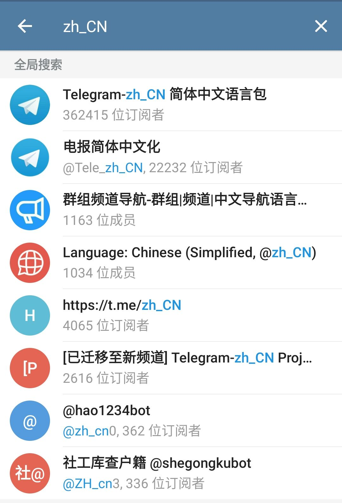
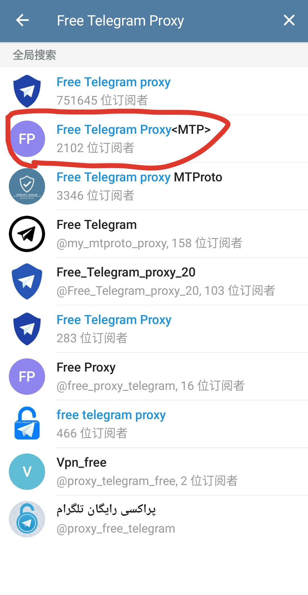
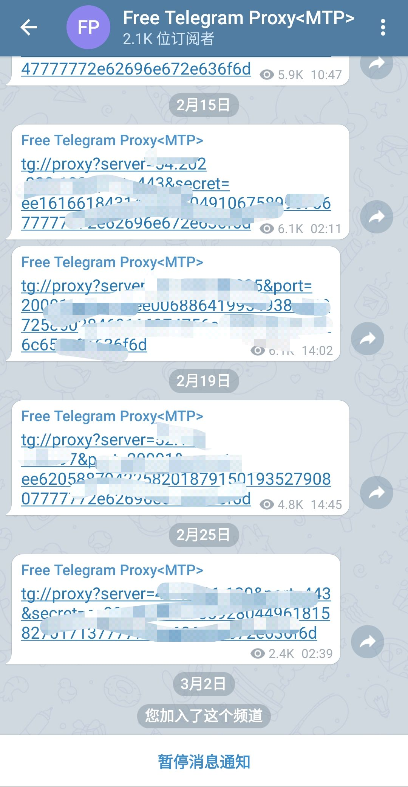

# Telegram普及计划

## 适用于不便一直挂梯子的安卓手机

### 安装临时翻墙梯子

(1)下载 [link](https://github.com/2dust/v2rayNG/releases/download/1.1.15/v2rayNG_1.1.15.apk)  

(2)免费账号(没错是轮子的) [link](https://github.com/Alvin9999/new-pac/wiki/v2ray%E5%85%8D%E8%B4%B9%E8%B4%A6%E5%8F%B7)  

(3)打开在(1)中下载的梯子输入(2)的账号  

(4) 在Google play安装Telegram,如果没有安装Google Play和谷歌框架,请安装.不安装谷歌框架即使安装Telegram也打不开   

(5) 登录Telegram  

(6) 在Telegram搜索zh CN 获取汉化(如图第一个)  

(7) 搜索Free Telegram Proxy 添加多个代理  

(8) 点击其中的链接并确认  

(9) 关闭在(1)中下载的梯子  

(10) 测试内置代理 祝好运

